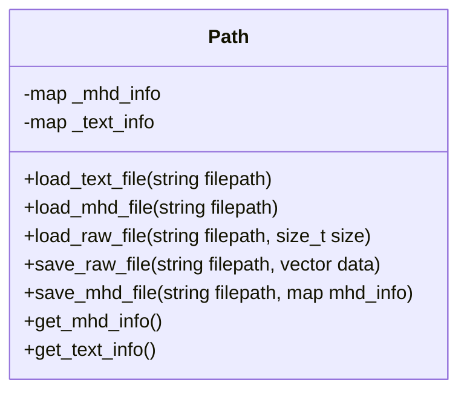
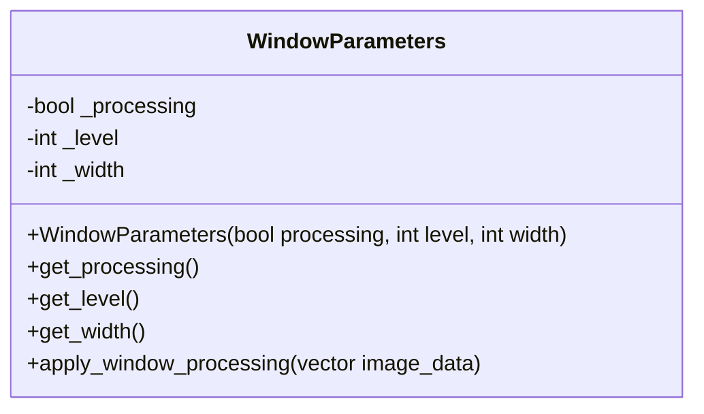
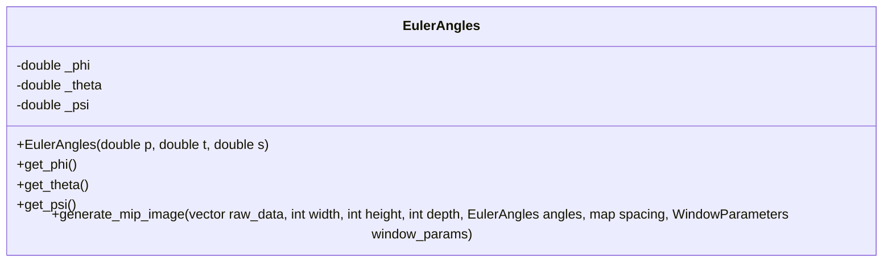

# MIP画像作成プログラム

## 概要
このプログラムは,任意の方向からMIP画像を作成するためのプログラムです．

1. テキストファイル（`ss2408.txt`）から情報を取得
2. RAW画像とMHDファイルを読込
3. MIP画像作成
4. 階調変換の実施
5. RAW形式で出力，コンソールにMIPの生成時間を表示

## 課題条件
- 画像平面は，RAW画像の中心座標を原点としてRAW画像を覆う球（半径𝑟）の接平面とする
- 生成する画像サイズは2𝑟×2𝑟とする ※等方化の処理を適宜実施
-  画像平面の位置はRAW画像の中心座標系でオイラー角で指定する
-  短時間で生成を目指す（目標は200ms）

## 必要環境
- C++対応コンパイラ
- CMake（バージョン3.10以上）
- OpneMP

## ビルド方法
```bash
mkdir build
cd build
cmake ..
make
```

## 使用方法
./MIPGenerator <出力ファイル> <入力テキストファイル>

## 入力テキストファイル形式
```bash
Input = 入力画像名
WindowProcessing = True/False
WindowLevel = 整数値
WindowWidth = 整数値
ViewAngle = phi theta psi
```

## ファイル構成
- `main.cpp`: メインプログラム
- `path.h/cpp`: ファイル入出力処理
- `mip.h/cpp`: MIP画像生成
- `window_parameters.h/cpp`: ウィンドウ処理
- `CMakeLists.txt`: ビルド設定
- `ss2408.txt`: MIP画像の情報を記載したテキストファイル
- `××.mhd`: ss2408.txtのInputキーに記載されていたファイル名のMHDファイル
- `××.raw`: ss2408.txtのInputキーに記載されていたファイル名のRAWファイル

## 高速化のための工夫
### 1. OpenMPによる並列処理
- MIP画像生成時の投影処理を並列化
- ウィンドウ処理を並列化

### 2. 計算の効率化
球面判定により不要な計算の省略


## クラス図
### Pathクラス


### WindowParametersクラス


### EulerAnglesクラス


