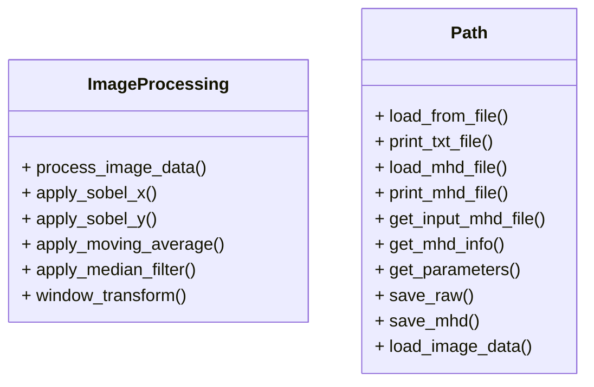

# CT画像処理プログラム

このプロジェクトは，頭部CT画像を読み取り，各種フィルタ処理や階調変換を行い，結果をRAW+MHD形式で保存するC++アプリケーションです．

---

## 実装内容

- テキストファイル（`ProcessingParameter.txt`）からパラメータ情報を取得
- MHDファイルから画像情報を取得
- RAWファイルの画像データを読み込み
- 階調変換（ウィンドウ処理）
- 各種フィルタの実装（SobelフィルタX/Y方向，移動平均，メディアンフィルタ）
- 処理結果をRAW+MHD形式で出力

---

## 使用技術

- C++17以上
- 標準ライブラリ `<filesystem>`, `<vector>`, `<string>`, `<iostream>`
- 独自実装の画像処理・パス操作クラス

---

## ディレクトリ構成

```
ss2406/
├── main.cpp                # メインプログラム
├── image_processing.cpp    # 画像処理関数群
├── image_processing.h      # 画像処理ヘッダ
├── path.cpp                # パス操作関数群
├── path.h                  # パス操作ヘッダ
├── Readme.md               # この説明ファイル
├── input/                  # 入力データフォルダ
│   ├── CT_Noise.mhd
│   ├── CT_Noise.raw
│   ├── CT_Original.mhd
│   ├── CT_Original.raw
│   └── ProcessingParameter.txt
├── output/                  # 出力データフォルダ
│   ├── CT_Original_SobelX.mhd
│   └── CT_Original_SobelX.raw
```

---

## 各ファイルの説明

### main.cpp
CT画像処理のメインプログラム．パラメータファイルを読み込み，画像データの入出力や各種フィルタ処理を統括します．

### image_processing.cpp / image_processing.h
画像処理（Sobelフィルタ，移動平均，メディアンフィルタ，階調変換など）の関数を実装しています．

### path.cpp / path.h
MHD/RAWファイルの入出力やパラメータファイルの読み込み，パス操作などを担当するユーティリティクラスです．

---

## 使用方法

1. 以下のコマンドでプログラムをコンパイルします．

    ```sh
    g++ -std=c++17 -o main main.cpp path.cpp image_processing.cpp
    ```

2. プログラムを実行します．

    ```sh
    ./main input/ProcessingParameter.txt
    ```

3. パラメータファイルやMHD/RAWファイルのパスは適宜変更してください．

---

## テスト

- `input/` フォルダ内のサンプルデータ（MHD/RAW/テキスト）を使って動作確認できます．
- 各種フィルタや階調変換の結果はRAW+MHD形式で出力されます．
- 標準出力で処理状況やファイル情報が表示されます．

---

## 注意事項

- 入力ファイル（MHD/RAW/テキスト）は正しいフォーマットで用意してください．
- 出力ファイルは同じフォルダまたは指定フォルダに保存されます．
- C++17以上のコンパイラが必要です（g++, clang++ など）．
- 画像処理のパラメータは `ProcessingParameter.txt` で指定します．

---

## 必要なライブラリ

- 標準C++17ライブラリ（追加インストール不要）

---

## パラメータファイル（ProcessingParameter.txt）について

```
Input：入力ファイルのパス
Output：出力ファイルのパス
ImageProcessing：処理内容（SobelX, SobelY, MovingAverage, Median, None）
WindowProcessing：階調変換の有無（True, False）
WindowLevel：ウィンドウ値
WindowWidth：ウィンドウ幅
MovingAverageFilterKernel：移動平均フィルタのカーネルサイズ（奇数）
MedianFilterKernel：メディアンフィルタのカーネルサイズ（奇数）
```

---

## ImageJでRAW+MHD画像を表示する方法

1. **ImageJを起動**
   [ImageJ公式サイト](https://imagej.nih.gov/ij/download.html)からダウンロード・インストールしてください。

2. **「File」→「Import」→「Raw...」を選択**
   - メニューから「File」→「Import」→「Raw...」をクリックします。

3. **RAWファイル（例：`CT_Original_SobelX.raw`）を選択**
   - 出力されたRAWファイルを選択します。

4. **画像情報を手動で入力**
   - ダイアログが表示されるので、画像サイズ（幅・高さ）、データ型（例：16-bit Signed）、エンディアン（通常はLittle-endian）、オフセット（通常は0）などを指定します。
   - 画像サイズはMHDファイルの「DimSize」欄を参照してください。

5. **「OK」を押して画像を表示**
   - 正しく設定すれば画像が表示されます。


**備考**
- RAWファイルのみの場合はMHDファイルの内容（サイズや型）を確認し、手動で設定してください。
- 画像が正しく表示されない場合は、設定値（特にサイズ・型）を再確認してください。
---

## クラス図



---

## ライセンス

このプロジェクトは [MITライセンス](https://opensource.org/licenses/MIT) の下で公開されています．
