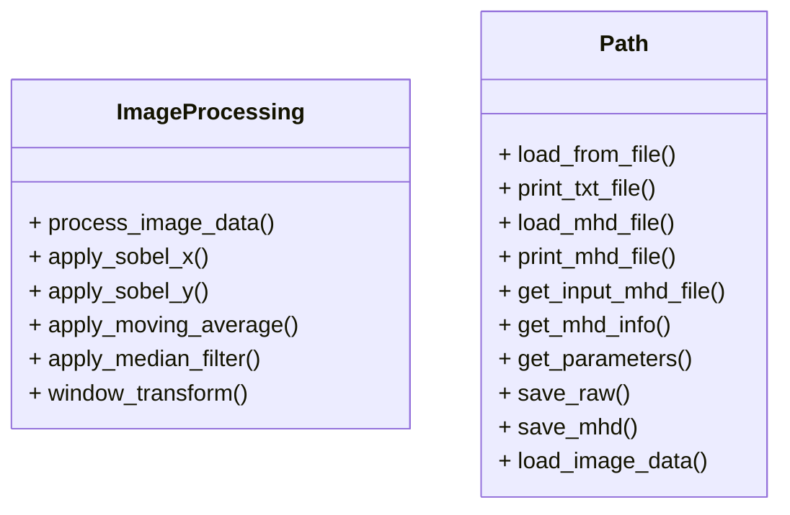

# CT画像処理プログラム

このプロジェクトは，頭部CT画像を読み取り，各種フィルタ処理や階調変換を行い，結果をRAW+MHD形式で保存するC++アプリケーションです．

---

## 実装内容

- テキストファイル（`ProcessingParameter.txt`）からパラメータ情報を取得
- MHDファイルから画像情報を取得
- RAWファイルの画像データを読み込み
- 階調変換（ウィンドウ処理）
- 各種フィルタの実装（SobelフィルタX/Y方向，移動平均，メディアンフィルタ）
- 処理結果をRAW+MHD形式で `output/` フォルダに出力

---

## ディレクトリ構成

```
ss2406/
├── CMakeLists.txt                # CMakeビルド設定
├── Readme.md                     # この説明ファイル
├── include/                      # ヘッダファイル
│   ├── image_processing.h
│   └── path.h
├── src/                          # ソースファイル
│   ├── image_processing.cpp
│   ├── main.cpp
│   └── path.cpp
├── input/                        # 入力データフォルダ
│   ├── CT_Noise.mhd
│   ├── CT_Noise.raw
│   ├── CT_Original.mhd
│   ├── CT_Original.raw
│   └── ProcessingParameter.txt
├── output/                       # 出力データフォルダ（自動生成）
│   ├── CT_Original_SobelX.mhd
│   └── CT_Original_SobelX.raw
```

---

## 各ファイルの説明

- `main.cpp`: メインプログラム。パラメータファイルを読み込み、画像データの入出力や各種フィルタ処理を統括します。
- `image_processing.cpp` / `image_processing.h`: 画像処理（Sobelフィルタ、移動平均、メディアンフィルタ、階調変換など）の関数群。
- `path.cpp` / `path.h`: MHD/RAWファイルの入出力やパラメータファイルの読み込み、パス操作などを担当するユーティリティクラス。

---

## 使用方法

1. `build`ディレクトリを作成し，移動する．
    ```sh
    mkdir build
    cd build
    ```

2. CMakeを使用してプロジェクトを構成する．
    ```sh
    cmake ..
    ```

3. プロジェクトをビルドする．
    ```sh
    cmake --build .
    ```

4. プログラムを実行する．
    ```sh
    ./ImageProcessing ../input/ProcessingParameter.txt
    ```
    - 入力MHD/RAWは `input/` フォルダ
    - 出力MHD/RAWは `output/` フォルダに自動保存されます

---

## テスト

- `input/` フォルダ内のサンプルデータ（MHD/RAW/テキスト）を使って動作確認できます。
- 各種フィルタや階調変換の結果は `output/` フォルダにRAW+MHD形式で出力されます。
- 標準出力で処理状況やファイル情報が表示されます。

---

## 注意事項

- 入力ファイル（MHD/RAW/テキスト）は正しいフォーマットで用意してください。
- 出力ファイルは `output/` フォルダに保存されます。
- C++17以上のコンパイラが必要です（g++, clang++ など）。
- 画像処理のパラメータは `ProcessingParameter.txt` で指定します。

---

## 必要なライブラリ

- 標準C++17ライブラリ（追加インストール不要）

---

## パラメータファイル（ProcessingParameter.txt）について

| 項目名                      | 説明                                         | 例・値                  |
|-----------------------------|----------------------------------------------|-------------------------|
| Input                       | 入力ファイルのパス（拡張子不要）             | CT_Original             |
| Output                      | 出力ファイルのベース名（拡張子不要）         | CT_Original_SobelX      |
| ImageProcessing             | 処理内容（フィルタ種別）                     | SobelX, SobelY, MovingAverage, Median, None |
| WindowProcessing            | 階調変換の有無（True/False）                 | True                    |
| WindowLevel                 | ウィンドウ値                                 | 100                     |
| WindowWidth                 | ウィンドウ幅                                 | 400                     |
| MovingAverageFilterKernel   | 移動平均フィルタのカーネルサイズ（奇数）     | 3                       |
| MedianFilterKernel          | メディアンフィルタのカーネルサイズ（奇数）   | 3                       |

---

## ImageJでRAW+MHD画像を表示する方法

1. **ImageJを起動**
   [ImageJ公式サイト](https://imagej.nih.gov/ij/download.html)からダウンロード・インストールしてください。

2. **「File」→「Import」→「Raw...」を選択**
   - メニューから「File」→「Import」→「Raw...」をクリックします。

3. **RAWファイル（例：`CT_Original_SobelX.raw`）を選択**
   - `output/CT_Original_SobelX.raw` を選択します。

4. **画像情報を手動で入力**
   - ダイアログが表示されるので、画像サイズ（幅・高さ）、データ型（例：16-bit Signed）、エンディアン（通常はLittle-endian）、オフセット（通常は0）などを指定します。
   - 画像サイズはMHDファイルの「DimSize」欄を参照してください。

5. **「OK」を押して画像を表示**
   - 正しく設定すれば画像が表示されます。

**備考**
- RAWファイルのみの場合はMHDファイルの内容（サイズや型）を確認し、手動で設定してください。
- 画像が正しく表示されない場合は、設定値（特にサイズ・型）を再確認してください。
- グレー表示の場合は「Image」→「Adjust」→「Brightness/Contrast」でコントラストを調整してください。

---

## クラス図


