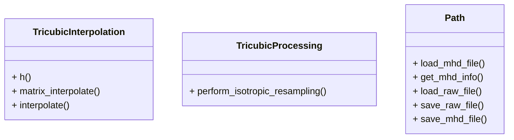

# 3次元CT画像等方化プログラム

このプロジェクトは，3次元CT画像（RAW+MHD形式）を読み込み，Tricubic補間による等方化（ボクセルサイズの統一）を行うC++アプリケーションです．

---

## 実装内容

- MHDファイルから画像情報（サイズ・空間分解能など）を取得
- RAWファイルの画像データを読み込み
- Tricubic補間による等方化（任意の分解能にリサンプリング）
- 処理結果をRAW+MHD形式で出力

---

## 使用技術

- C++17以上
- 標準ライブラリ `<filesystem>`, `<vector>`, `<string>`, `<iostream>`
- CMakeによるビルド
- Tricubic補間の独自実装

---

## ディレクトリ構成

```
ss2407/
├── CMakeLists.txt                # CMakeビルド設定
├── Readme.md                     # この説明ファイル
├── include/                      # ヘッダファイル
│   ├── path.h
│   ├── tricubic_interpolation.h
│   └── tricubic_processing.h
├── src/                          # ソースファイル
│   ├── main.cpp
│   ├── path.cpp
│   ├── tricubic_interpolation.cpp
│   └── tricubic_processing.cpp
├── input/                        # 入力データフォルダ
│   ├── ChestCT.mhd
│   └── ChestCT.raw
├── output/                       # 出力データフォルダ（自動生成）
│   ├── ChestCT_output.mhd
│   └── ChestCT_output.raw
├── build/                        # ビルド成果物
│   └── ImageProcessing           # 実行ファイル
```

---

## 使用方法

1. `build`ディレクトリを作成し，移動する．
    ```sh
    mkdir build
    cd build
    ```

2. CMakeを使用してプロジェクトを構成する．
    ```sh
    cmake ..
    ```

3. プロジェクトをビルドする．
    ```sh
    cmake --build .
    ```

4. プログラムを実行する．
    ```sh
    ./ImageProcessing ../input/ChestCT.mhd ../output/ChestCT_output.mhd 1.0
    ```
    - 入力MHD/RAWは `input/` フォルダ
    - 出力MHD/RAWは `output/` フォルダに自動保存されます

---

## ファイルの説明

- `main.cpp`: メイン処理（引数解析・ファイル入出力・等方化呼び出し）
- `path.cpp` / `path.h`: MHD/RAWファイルの入出力・パラメータ取得
- `tricubic_interpolation.cpp` / `tricubic_interpolation.h`: Tricubic補間の計算
- `tricubic_processing.cpp` / `tricubic_processing.h`: 等方化処理（リサンプリング）

---

## クラスと関数の説明

### TricubicInterpolation クラス

- `float h(float t, float a)`: h(t)関数の実装
- `float matrix_interpolate(const float src[4][4], float t_x, float t_y, float a)`: 1次元Cubic補間
- `float interpolate(const std::vector<short>& data, int width, int height, int depth, float x, float y, float z, float a)`: 3次元Tricubic補間

### TricubicProcessing クラス

- `static std::vector<short> perform_isotropic_resampling(const std::vector<short>& input_data, int width, int height, int depth, float new_width, float new_height, float new_depth, float a, int interpolation_method)`: 等方化処理

---

## MHD/RAWファイルの設定例

MHDファイル（例：`output/ChestCT_output.mhd`）の内容を参考に，ImageJ等でRAW画像を表示する際は以下の設定を参照してください．

| MHDファイルの項目            | ImageJでの設定例                   | 備考                       |
|-----------------------------|------------------------------------|----------------------------|
| DimSize = 512 512 310       | Width: 512, Height: 512, Slices:310| 画像サイズ（幅・高さ・奥行）|
| ElementType = MET_SHORT     | 16-bit Signed                      | データ型                   |
| ElementByteOrderMSB = False | Little-endian                      | エンディアン（通常はLittle）|
| ElementDataFile = ...       | RAWファイルを選択                  | ファイルパス               |

---

## ImageJでChestCT_output.rawを表示する設定例

1. **ImageJを起動**
   [ImageJ公式サイト](https://imagej.nih.gov/ij/download.html)からダウンロード・インストールしてください。

2. **「File」→「Import」→「Raw...」を選択**
   - メニューから「File」→「Import」→「Raw...」をクリックします。

3. **RAWファイル（`ChestCT_output.raw`）を選択**
   - `ss2407/output/ChestCT_output.raw` を選択します。

4. **画像情報を手動で入力**
   - ダイアログが表示されるので、以下の値を入力してください。

| 項目         | 設定値                   | 備考                       |
|--------------|--------------------------|----------------------------|
| Width        | 512                      | MHDファイルのDimSizeより    |
| Height       | 512                      | MHDファイルのDimSizeより    |
| Number of Images (Slices) | 310           | MHDファイルのDimSizeより    |
| Data Type    | 16-bit Signed            | MHDファイルのElementTypeより|
| Endian       | Little-endian            | ElementByteOrderMSB=False   |
| Offset       | 0                        | 通常は0                     |

5. **「OK」を押して画像を表示**
   - 正しく設定すれば3次元CT画像が表示されます。

---

### 備考

- 画像がグレー表示になる場合は「Image」→「Adjust」→「Brightness/Contrast」でコントラストを調整してください。
- データ型やサイズが間違っていると正しく表示されません。必ずMHDファイルの内容を参照してください。
- この設定は `ChestCT_output.mhd` の内容（DimSize, ElementType, ElementByteOrderMSB）に基づいています。他のファイルを表示する際は適宜読み替えてください。

---

## クラス図


