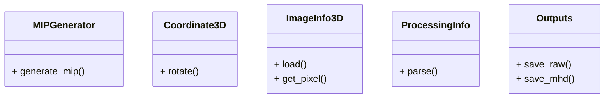

# 最大値投影法（MIP）画像生成プログラム

このプロジェクトは，3次元画像（RAW+MHD形式）を読み込み，最大値投影法（MIP: Maximum Intensity Projection）による画像生成と高速化手法を示すC++アプリケーションです．

---

## 実装内容

- テキストファイル（`ProcessingParameter.txt`）からパラメータ情報を取得
- MHDファイルから画像情報を取得
- RAWファイルの画像データを読み込み
- オイラー角による画像回転
- 最大値投影法（MIP画像）の生成
- OpenMPによる高速化
- 処理結果をRAW+MHD形式で `output/` フォルダに出力

---

## ディレクトリ構成

```
ss2408/
├── CMakeLists.txt                # CMakeビルド設定
├── README.md                     # この説明ファイル
├── include/                      # ヘッダファイル
│   ├── Coordinate3D.h
│   ├── ImageInfo.h
│   ├── ImageInfo2D.h
│   ├── ImageInfo3D.h
│   ├── MIPGenerator.h
│   ├── Outputs.h
│   ├── ProcessingInfo.h
│   └── ProcessingInfoParser.h
├── src/                          # ソースファイル
│   ├── Coordinate3D.cpp
│   ├── ImageInfo.cpp
│   ├── ImageInfo2D.cpp
│   ├── ImageInfo3D.cpp
│   ├── main.cpp
│   ├── MIPGenerator.cpp
│   ├── Outputs.cpp
│   ├── ProcessingInfo.cpp
│   └── ProcessingInfoParser.cpp
├── input/                        # 入力データフォルダ
│   ├── foo.mhd
│   ├── foo.raw
│   └── ProcessingParameter.txt
├── output/                       # 出力データフォルダ（自動生成）
│   ├── foo_mip.mhd
│   └── foo_mip.raw
```

---

## 各ファイルの説明

- `main.cpp`: メインプログラム。パラメータファイルを読み込み、画像データの入出力やMIP画像生成を統括します。
- `MIPGenerator.cpp` / `MIPGenerator.h`: 最大値投影法（MIP画像）の生成処理。
- `Coordinate3D.cpp` / `Coordinate3D.h`: 3次元座標・回転処理。
- `ImageInfo*.cpp` / `ImageInfo*.h`: 画像情報管理（2D/3D）。
- `ProcessingInfo*.cpp` / `ProcessingInfo*.h`: パラメータ情報管理・パース処理。
- `Outputs.cpp` / `Outputs.h`: 画像出力処理。

---

## 使用方法

1. `build`ディレクトリを作成し，移動する．
    ```sh
    mkdir build
    cd build
    ```

2. CMakeを使用してプロジェクトを構成する．
    ```sh
    cmake ..
    ```

3. プロジェクトをビルドする．
    ```sh
    cmake --build .
    ```

4. プログラムを実行する．
    ```sh
    ./MIPGenerator ../input/ProcessingParameter.txt
    ```
    - 入力MHD/RAWは `input/` フォルダ
    - 出力MIP画像（RAW+MHD）は `output/` フォルダに自動保存されます

---

## テスト

- `input/` フォルダ内のサンプルデータ（MHD/RAW/テキスト）を使って動作確認できます。
- MIP画像の結果は `output/` フォルダにRAW+MHD形式で出力されます。
- 標準出力で処理状況やファイル情報・処理時間が表示されます。

---

## 注意事項

- 入力ファイル（MHD/RAW/テキスト）は正しいフォーマットで用意してください。
- 出力ファイルは `output/` フォルダに保存されます。
- C++17以上のコンパイラが必要です（g++, clang++ など）。
- OpenMPによる高速化を利用する場合は，コンパイラのOpenMPオプションを有効にしてください。
- 画像処理のパラメータは `ProcessingParameter.txt` で指定します。

---

## 必要なライブラリ

- 標準C++17ライブラリ（追加インストール不要）
- OpenMP（高速化時のみ）

---

## パラメータファイル（ProcessingParameter.txt）について

| 項目名           | 説明                                         | 例・値                  |
|------------------|----------------------------------------------|-------------------------|
| Input            | 入力ファイル名（拡張子不要）                 | foo                     |
| WindowProcessing | ウィンドウ処理の有無（True/False）           | True                    |
| WindowLevel      | ウィンドウレベル（整数）                     | 100                     |
| WindowWidth      | ウィンドウ幅（非負整数）                     | 400                     |
| ViewAngle        | オイラー角（phi theta psi, 単位:度）         | 30 45 0                 |

---

## ImageJでRAW+MHD画像を表示する方法

1. **ImageJを起動**
   [ImageJ公式サイト](https://imagej.nih.gov/ij/download.html)からダウンロード・インストールしてください。

2. **「File」→「Import」→「Raw...」を選択**
   - メニューから「File」→「Import」→「Raw...」をクリックします。

3. **RAWファイル（例：`foo_mip.raw`）を選択**
   - `output/foo_mip.raw` を選択します。

4. **画像情報を手動で入力**
   - ダイアログが表示されるので、画像サイズ（幅・高さ）、データ型（例：16-bit Signed）、エンディアン（通常はLittle-endian）、オフセット（通常は0）などを指定します。
   - 画像サイズはMHDファイルの「DimSize」欄を参照してください。

5. **「OK」を押して画像を表示**
   - 正しく設定すれば画像が表示されます。

**備考**
- RAWファイルのみの場合はMHDファイルの内容（サイズや型）を確認し、手動で設定してください。
- 画像が正しく表示されない場合は、設定値（特にサイズ・型）を再確認してください。
- グレー表示の場合は「Image」→「Adjust」→「Brightness/Contrast」でコントラストを調整してください。

---

## クラス図


