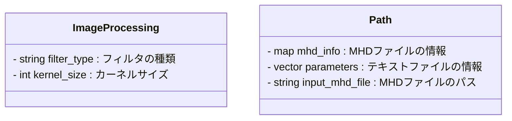

# CT画像処理プログラム

## 概要
このプログラムは,頭部CT画像を読み取り,各種フィルタを試すためのものです.

1. テキストファイル（`ProcessingParameter.txt`）から情報を取得
2. MHDファイルから画像情報を取得
3. RAWファイルの画像を読み込み
4. 階調変換（Window Processing）
5. 各種フィルタの実装（Sobel, 移動平均, メディアンフィルタ）
6. 結果をRAW + MHD形式で出力

## 使用方法
1. 以下のコマンドを実行してプログラムをコンパイル
    ```sh
    g++ -std=c++17 -o main main.cpp path.cpp image_processing.cpp
    ```
2. プログラムを実行
    ```sh
    ./main <ProcessingParameter.txtのパス>
    ```

## ファイル構成
- `main.cpp`: メインプログラム
- `image_processing.cpp`: 画像処理を行う関数
- `path.cpp`: パスに関する関数
- `image_processing.h`: クラスを記載

### 関数について


- `apply`: 画像データにフィルタを適用
- `apply_sobel_x`: Sobelフィルタ（X方向）を適用
- `apply_sobel_y`: Sobelフィルタ（Y方向）を適用
- `apply_moving_average`: 移動平均フィルタを適用
- `apply_median_filter`: メディアンフィルタを適用
- `window_transform`: 階調変換を実施
- `process_image_data`: 画像データの処理
- `load_from_file`: テキストファイルの読み込み
- `print_txt_file`: テキストファイルの内容の表示
- `load_mhd_file`: MHDファイルの読み込み
- `print_mhd_file`: MHDファイルの内容の表示
- `get_input_mhd_file`: `Input`キーの値を取得し,対応する`.mhd`ファイルのパスを生成
- `get_mhd_info`: MHDファイルの情報の取得
- `get_parameters`: パラメータの取得
- `save_raw`: `raw`ファイルの保存
- `save_mhd`: `mhd`ファイルの保存
- `load_image_data`: 画像データファイルの読み込み

### クラス図

