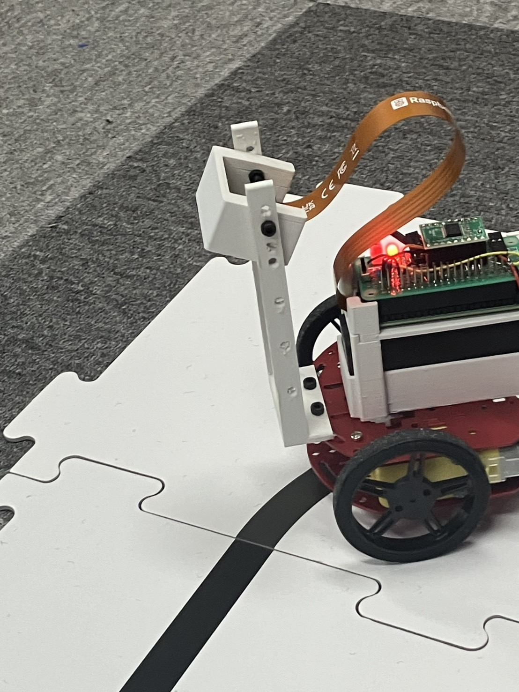

# ロボットカー自動操縦プログラム（深層学習＋カメラ画像）

このプロジェクトは，ロボットカーの作成（はんだ付け・組み立て）から，カメラ画像による深層学習・自動操縦までを一貫して行うPythonプログラムです．
ロボットカー上に搭載したカメラで走行中の画像を取得し，走行データを収集・学習・推論し，自動で操縦できるようにしました．

---

## 実装内容

- ロボットカーの組み立て（はんだ付け・パーツ接続・カメラ搭載）
- カメラ画像の取得・保存
- 走行データ（画像＋操作情報）の収集
- 深層学習（ニューラルネットワーク）による操縦モデルの学習
- 学習済みモデルによる自動操縦（推論）
- ソケット通信による制御・データ送受信
- 手動操縦・自動操縦の切り替え
- テスト・評価用スクリプト

---

## ディレクトリ構成

```
ss2414/
├── driving.py      # 自動操縦（学習済みモデルでロボットカーを運転）
├── training.py     # 学習（走行データからモデルを作成）
├── test.py         # テスト・評価（学習済みモデルの精度確認・シミュレーション）
├── teaching.py     # 手動操縦・データ収集（画像＋操作情報の記録）
├── receiver.py     # ソケット通信で画像・制御信号受信
├── sender.py       # ソケット通信で画像・制御信号送信
├── README.md       # この説明ファイル
```

---

## 各ファイルの役割

- `training.py`: **学習用プログラム**
  収集した走行データ（画像＋操作情報）を使って深層学習モデルを作成します．
- `driving.py`: **自動操縦プログラム**
  学習済みモデルを使い，カメラ画像から操縦指令を生成してロボットカーを自動運転します．
- `test.py`: **テスト・評価プログラム**
  学習済みモデルの精度確認やシミュレーションを行います．`driving.py`と処理内容が似ていますが，主に評価・検証用途です．
- `teaching.py`: **手動操縦・データ収集プログラム**
  手動でロボットカーを操縦しながら，画像と操作情報を記録します．学習データの作成に使用します．
- `receiver.py` / `sender.py`: ソケット通信で画像や制御信号を送受信します．

---

## 深層学習モデルの詳細

本プロジェクトでは，**PyTorchのResNet-18** をベースとした回帰モデルを使用しています．

- `torchvision.models.resnet18(pretrained=True)` で事前学習済みResNet-18を利用
- 最終層（`fc`）を `nn.Linear(self.model.fc.in_features, 2)` に置き換え，出力を2次元（左右のモーター速度や操縦指令）に変更
- 入力はカメラ画像（例：RGB, 640×480など）
- 出力はロボットカーの左右モーター速度やステアリング指令（連続値）

### 学習の流れ

1. `teaching.py` で手動操縦し，画像と操作情報（左右速度など）を記録
2. `training.py` で記録したデータを使い，ResNet-18回帰モデルを学習
   - 損失関数はMSE（平均二乗誤差）など
   - 最適化手法はAdam等
3. 学習済みモデルを保存し，`driving.py` で推論に利用

### モデルの特徴

- 画像から直接操縦指令を回帰予測するため，従来の特徴抽出やルールベース制御より柔軟
- 転移学習（ResNet-18の事前学習済み重み）を活用し，少ないデータでも高精度な推論が可能
- 出力を2次元にすることで，左右モーターやステアリングの同時制御が可能

---

## 使用方法

1. ロボットカーを組み立て，カメラを搭載する（はんだ付け・パーツ接続など）
2. `teaching.py` を使って手動操縦し，走行画像と操作情報を収集
3. `training.py` で収集したデータを使い，深層学習モデル（ResNet-18回帰モデル）を学習
4. 学習済みモデルを `driving.py` で読み込み，自動操縦を実行
5. 必要に応じて `test.py` でモデルの精度評価やテスト走行を行う
6. `receiver.py` / `sender.py` でロボットカーとPC間の通信を管理

---

## 注意事項

- Python 3.x が必要です
- 深層学習にはPyTorch（torch, torchvision）が必要です
- ソケット通信のポート番号やIPアドレスは環境に合わせて設定してください
- カメラ画像の解像度やフレームレートは環境に合わせて調整してください

---

## ロボットカー



---

このプロジェクトは [MITライセンス](https://opensource.org/licenses/MIT) の下で公開されています．
